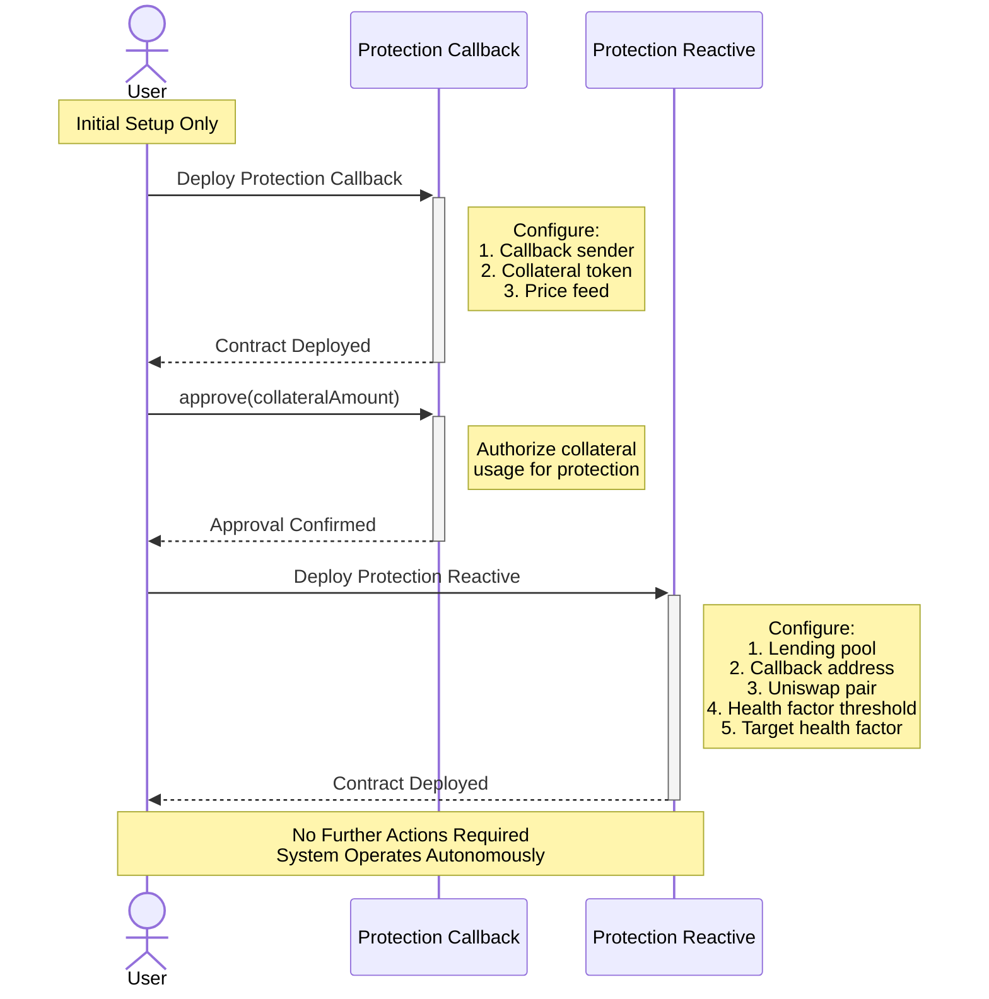
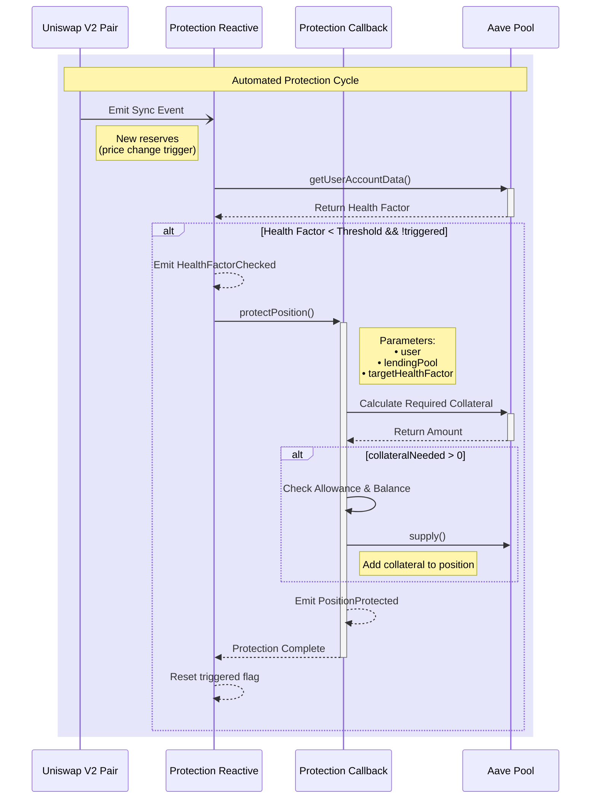

# Aave Liquidation Protection System

The **Aave Liquidation Protection System** implements a reactive smart contract solution that monitors Uniswap V2 price feeds to protect Aave positions from liquidation. When a user's health factor approaches a critical threshold, the system automatically supplies additional collateral to maintain position safety. This system demonstrates advanced usage of reactive smart contracts for automated DeFi position management.

## Contracts

### **Protection Callback Contract**: `AaveLiquidationProtectionCallback`
- Handles the execution of protection actions
- Integrates with Chainlink price feeds for accurate collateral calculations
- Manages token approvals and transfers
- Interacts with Aave lending pool to supply additional collateral
- Emits `PositionProtected` events upon successful execution
- Stateless design allows reuse across multiple positions

### **Reactive Contract**: `AaveLiquidationProtectionReactive`
- Subscribes to Uniswap V2 pair's `Sync` events via `UNISWAP_V2_SYNC_TOPIC_0`
- Monitors price changes through Uniswap reserves
- Checks Aave position health factors
- Triggers protection actions when health factor drops below threshold
- Tracks protection status through `triggered` state
- Confirms completion through `PositionProtected` events

## Workflow
### User POV

### Behind The Scenes


## Key Features

### Autonomous Operation
- Zero maintenance after initial setup
- Automatic health factor monitoring
- Proactive position protection
- Event-driven execution

### Safety Mechanisms
- Price verification through Chainlink feeds
- Health factor threshold validation
- Token approval checks
- Gas-efficient execution

### Flexible Configuration
- Customizable health factor thresholds
- Configurable target health factors
- Support for different collateral tokens
- Adjustable protection parameters

## System Flow

1. **Monitoring Phase**
   - Reactive contract watches Uniswap price changes
   - Continuously evaluates position health factors
   - Identifies protection opportunities

2. **Protection Trigger**
   - Detects health factor below threshold
   - Calculates required collateral amount
   - Initiates protection callback

3. **Execution Phase**
   - Verifies current position status
   - Supplies additional collateral
   - Confirms position safety
   - Emits completion events

## Future Enhancements

The system can be extended with:

* **Multiple Position Support**
  - Manage multiple Aave positions
  - Track different collateral types
  - Handle varied risk parameters

* **Advanced Risk Management**
  - Dynamic threshold adjustment
  - Market volatility consideration
  - Gas price optimization

* **Enhanced Monitoring**
  - Multiple price feed sources
  - Aggregated price validation
  - Historical trend analysis

* **Improved Recovery Mechanisms**
  - Failed transaction handling
  - Automatic retry logic
  - Emergency pause functionality

## Usage Guidelines

1. **Initial Setup**
   - Deploy callback contract
   - Configure collateral approvals
   - Deploy reactive contract
   - Set protection parameters

2. **Monitoring**
   - System automatically tracks position health
   - No manual intervention required
   - Protection executes when needed

3. **Maintenance**
   - Monitor protection events
   - Maintain sufficient collateral
   - Adjust parameters if needed

## Events

### Protection Callback Events
```solidity
event PositionProtected(
    address user,
    address lendingPool,
    uint256 newHealthFactor,
    uint256 collateralAdded
);
```

### Reactive Contract Events
```solidity
event HealthFactorChecked(
    uint256 currentHealthFactor,
    uint256 threshold
);

event CallbackSent();
event Done();
```

## Security Considerations

- Uses Chainlink price feeds for reliable data
- Implements access controls and validation
- Follows standard ERC20 token handling
- Includes threshold verification checks
- Maintains system state consistency

## Dependencies

- OpenZeppelin Contracts
- Chainlink Price Feeds
- Aave V3 Protocol
- Uniswap V2 Protocol
